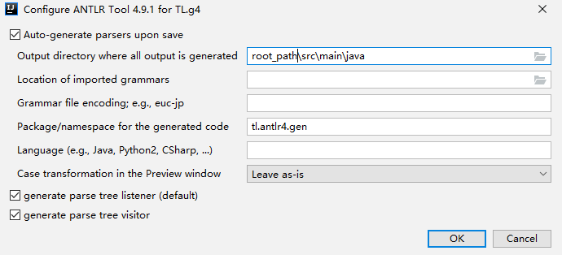

# 在idea中开发

下载 idea 插件 antrl4



```
Ctrl_Shift+G
```

# maven 使用
```
<dependency>
  <groupId>net.crtrpt</groupId>
  <artifactId>tiny-language</artifactId>
  <version>${tiny-language-version}</version>
</dependency>
```
## (Un)license

[The Unlicense](http://unlicense.org)
